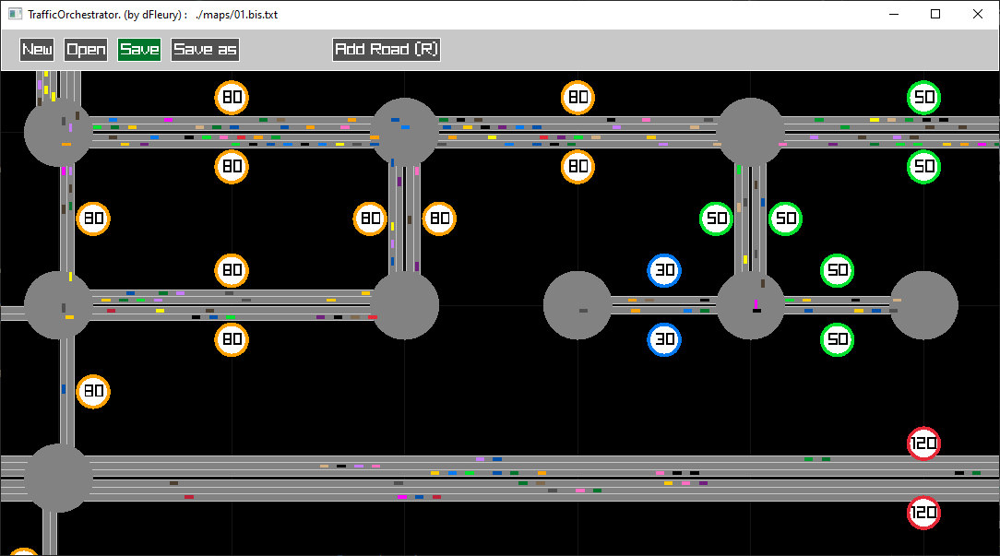
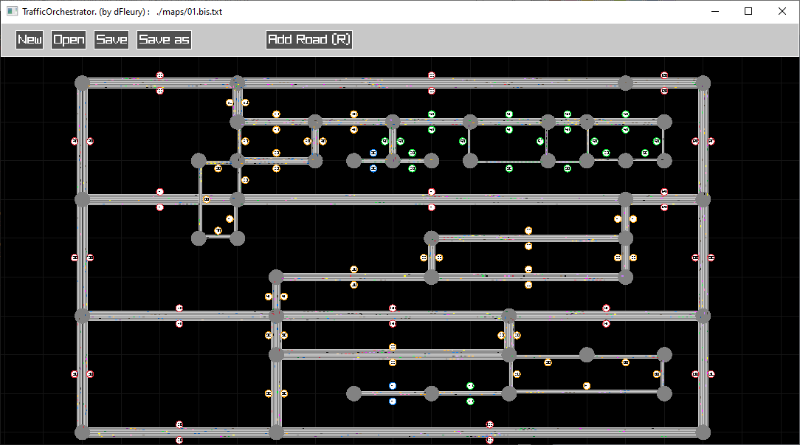
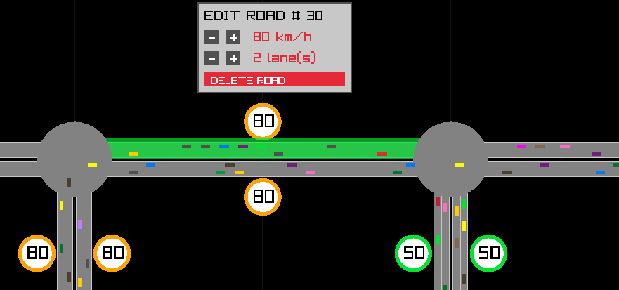

# Traffic Orchestrator


A road traffic simulator currently in development, with the ability to create roads and nodes and adjust the maximum speed of certain roads to reduce congestion.



## Features

- Open, create and save a map file
- Map editing:
  - Create and edit roads with customizable lane count and speed limit
- Cars drive at the maximum speed of the road (multiplied by a personal factor)
- Cars maintain a certain distance from the vehicle in front
- When a car reaches the end of a road, it moves to a random road connected to the node.
  - If no road is available, the car disappears. (The node is an **exit point**)

## Todo

- Allow cars to change lanes on a road
- Improved node management (roundabouts, intersections, curves):
  - Currently, when a car reaches a node, it teleports to the next road.
- Add more traffic elements and rules (traffic lights, stop signs, pedestrian crossings, right-of-way rules, etc.)
- Use an "AI" to optimize traffic flow management in real-time:
  - The AI could control road elements (speed limits, traffic lights, etc.)
  - It could also manage each vehicle (lane changes, speed, best route)
- A node can be an **entry point** (cars spawn at this node)
- Confirm unsaved map before: opening a map, creating a new map, or quitting
- Improved zoom management and allow map navigation with the mouse in addition to the keyboard
- Display elapsed time and allow adjusting the game speed
- Ability to insert a node in the middle of a road + better bridge management
- Adjust UI size



## Notes

- A road can have multiple lanes but only one direction, so to create a 2x3 lane road, you need to create two roads in opposite directions (or check the "**_create both directions_**" option).
- Speeds are in **km/h**, and the unit of distance is **meters**
- The average **dimensions of a car** are 4.7 x 1.8 m, but here they all are 5 x 2 m

## Technologies

- **C++**
- **Raylib**: A simple and easy-to-use library to create 2D games.



## Usage

You can either:

- ### Download the precompiled binaries (Windows and Linux)

  - Download the precompiled binaries along with map files in a compressed archive located in the `assets` folder.

- ### or Clone the repository and compile the project

  ```bash
  git clone https://github.com/fleuryD/traffic-orchestrator.git
  cd traffic-orchestrator
  make

  ./traffic-orchestrator       # for linux
  .\traffic-orchestrator.exe   # for windows
  ```

  If Raylib is not installed or not compiled, run the following commands:

  ```bash
  git clone https://github.com/raysan5/raylib.git
  cd raylib/src
  make PLATFORM=PLATFORM_DESKTOP RAYLIB_LIBTYPE=STATIC
  ```
